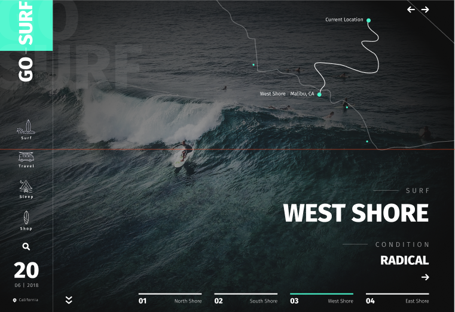

#  Верстка с использованием сборки на gulp 4 и scss, использован Slick.JS
#   Макет  figma, присутствуют интерактивные элементы. 

#  Layout using assembly on gulp 4 and scs, used Slick.JS
# Figma layout, interactive elements are present.

##  [ссылка на макет/link to the layout](https://www.figma.com/design/yqTfu0VqosY86wml4VdBsL/gosurf-blackflagcreative?node-id=0-1&t=3k2p1jikGGCcaeYW-0)

## запуск gulp/launch gulp: 
## npm i gulp@4.0.2
## gulp
 
